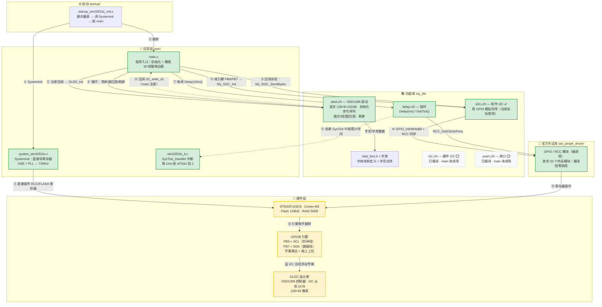
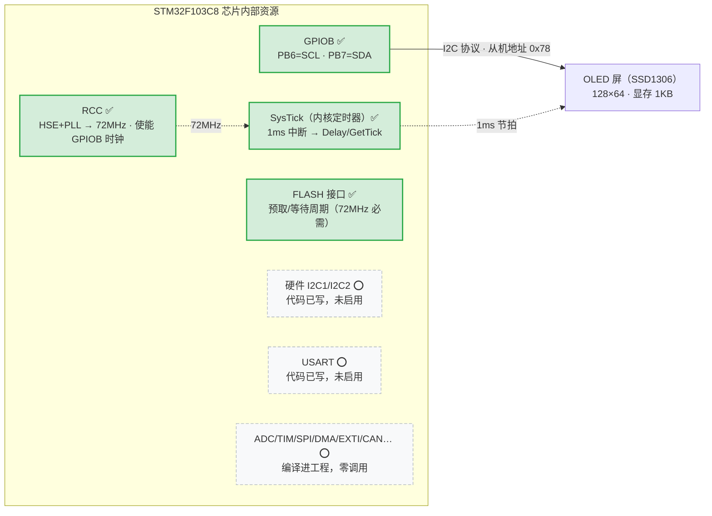
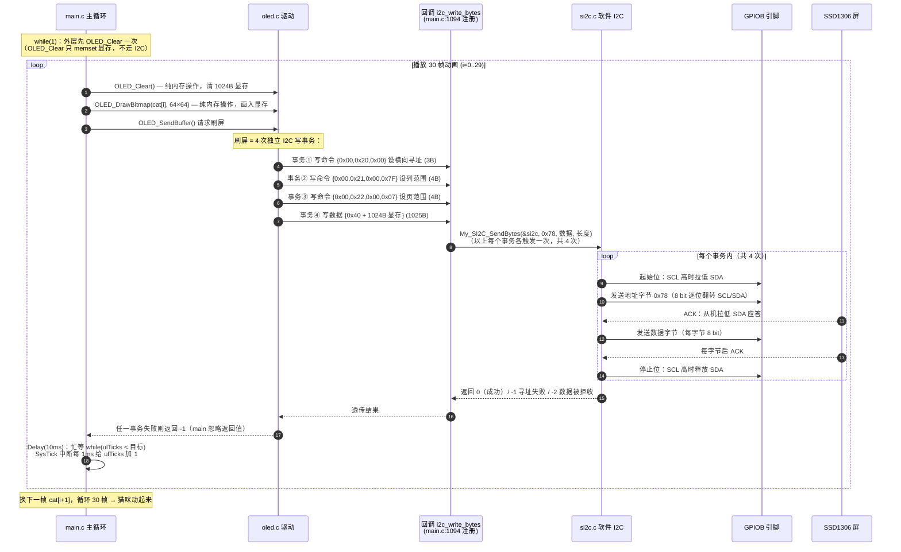

# OLEDTest 项目架构说明（面向嵌入式学习者）

> 芯片：STM32F103C8（Cortex-M3，72MHz）　屏幕：SSD1306 OLED 128×64（I2C 地址 0x78）
> 功能：用 GPIO 模拟 I2C，往屏上循环播放 30 帧猫咪动画。
> 全项目实际用到的外设只有：**GPIOB（PB6/PB7）、SysTick、RCC/FLASH（时钟）**。

---

## ① 系统架构总览（绿=正在使用，灰=编译了但没启用）

## ② 外设资源地图（芯片视角：谁在用、谁闲着）

## ③ 一帧动画的数据流（从内存到屏幕）

## 📋 外设速查表

| 功能 | 使用的外设/资源 | 引脚/参数 | 代码位置 |
|------|----------------|-----------|----------|
| OLED 通信 | GPIOB（软件模拟 I2C） | **PB6=SCL、PB7=SDA**，开漏输出 | `main.c:1086`、`si2c.c` |
| OLED 屏幕 | SSD1306（I2C 从机） | 地址 **0x78**，128×64，显存 1024B | `oled.h:16`、`oled.c` |
| 延时/帧率 | SysTick（内核定时器） | 1ms 中断 → `Delay(10ms)` | `delay.c`、`stm32f10x_it.c:163` |
| 系统时钟 | RCC + HSE + PLL | 72MHz（直接写寄存器） | `system_stm32f10x.c` |
| 备用：串口 | USART（未启用） | — | `usart.c`（main 未调用） |
| 备用：硬件 I2C | I2C1/I2C2（未启用） | — | `i2c.c`（main 未调用） |

## 🎓 值得学习的 5 个嵌入式知识点

1. **软件 I2C vs 硬件 I2C**：`si2c.c` 用 GPIO 逐位翻转模拟 I2C 时序（起始位/地址/ACK/停止位），对照 `i2c.c` 的外设版，理解"协议"与"实现方式"的关系。
2. **SysTick 与裸机计时**：`delay.c` 配置 SysTick 每 1ms 中断，`SysTick_Handler` 累加 `ulTicks` —— RTOS 时间片的基础，也是非阻塞延时/超时的入门写法。
3. **回调解耦**：`OLED_InitTypeDef.i2c_write_cb` 函数指针让 OLED 驱动不依赖具体 I2C 实现，换硬件 I2C 只改 main.c 一行 —— 驱动分层的标准范例。
4. **SSD1306 显存模型**：128 列 × 8 页（每页 8 像素高）= 1024B，画点公式 `pBuffer[x + (y/8)*128] |= 1<<(y%8)`（`oled.c:1215`）。
5. **时钟树与外设使能**：`SystemInit` 直接写 RCC 寄存器把系统时钟提到 72MHz；每个外设使用前必须 `RCC_APB2PeriphClockCmd` 开时钟（`si2c.c:31-65`）——新手"程序没反应"一半是漏了这一步。
